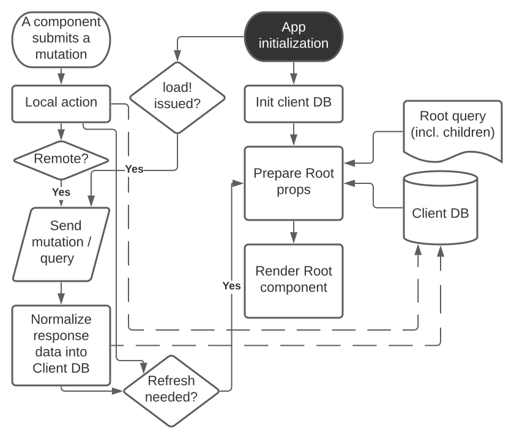

# Minimalist Fulcro Tutorial

:url-book: https://book.fulcrologic.com/
:url-eql: https://edn-query-language.org/
:url-pathom-resolvers: https://blog.wsscode.com/pathom/v2/pathom/2.2.0/connect/resolvers.html#_parameters

WARNING: Work in progress

.FIXME
--
* Clarify the confusion around ``transact!``-ed mutations (transactions?) - which can include `load!` vs. EQL mutations and Fulcro mutations vs. EQL/server mutations.
--

This is a minimalistic introduction to Fulcro that focuses on HOW and not WHY. For the latter, read the awesome {url-book}[Fulcro Developers Guide], especially the introductory chapters 2-4.
The goal is to enable you to read, understand, and tinker with the code of a Fulcro application.

## Prerequisities

This tutorial expects that you have went through the *EQL Tutorial* and are familiar with EQL, queries, joins. It will not work without that knowledge. You also need to have an idea about Pathom and {url-pathom-resolvers}[Pathom resolvers] (global, ident, parameters). 

It also assumes that you are already familiar with *React* and thus with concepts such as components, factories, elements, a tree of components, passing "props" from the root component, UI as a function of data.

It is helpful to know a little about the principles of *GraphQL*.

## A word of warning

Fulcro is likely very different from any other web framework you have worked with before, even though there are intersections with various technologies (React, GraphQL). It is most advisable that you familiarize yourself well with its key concepts.

## An overview of Fulcro

Fulcro is a full-stack web framework. These are the main components:

.Fulcro system view


. Frontend
.. _UI_ - Fulcro/React components render a DOM and submit mutations to the transaction (Tx) subsystem
.. _Tx_ (transaction subsystem) - asynchronously executes local mutations and sends remote mutations and queries to the remote backend
.. _Client DB_ - data from the backend is _normalized_ into the client-side DB (cache); _Tx_ typically schedules a re-render afterwards
. Backend
.. _Pathom_ receives EQL queries and mutations and responds with a data tree

### Key concepts and elements

We will briefly describe the key terms we are going to use a lot. Some are later explained in more detail.

App::
A reference to the current Fulcro application, containing configuration, the client DB, etc. Produced by `app/fulcro-app` and used when calling `transact!` or `load!` when a component `this` is not available.
Client DB::
The client-side cache of data. It is a map of maps: entity name (e.g. `:person/id`) -> entity id (e.g. `123`) -> properties of the entity (e.g. `{:person/id 123, :person/fname "Jo", :person/address [:address/id 3]}`).
Component::
A Fulcro component is a React component with extra meta data.
EQL (EDN Query Language) server::
The backend includes an EQL server - Pathom - that can process EQL queries and mutations and respond with data (nested, tree-shaped).
Ident::
Data: the identifier of a data entity composed of the ID property name and value. Ex.: `[:person/id 123]`. Component: a function that returns an ident (discussed later).
Mutation::
When components want to "change" something, they submit a mutation describing the desired change to the transaction subsystem. Mutations can be local and/or remote. A request to load data from the backend is also a mutation (on the Fulcro side; to Pathom it is sent as a plain EQL query). Remote mutations are sent as EQL mutations.
Normalization of data::
Data in the client DB is mostly stored in a https://en.wikipedia.org/wiki/Database_normalization[normalized form in the database sense]. I.e. entities do not include other entities but only their _idents_.
Query::
Each stateful component declares what data it needs using an EQL query. If it has stateful children, it also includes their query in its own.
Root component::
The top component of the UI, customary called `Root`.
Transaction subsystem::
Components submit mutations to the transaction subsystem for execution. You can think of it as an asnychronous queue.

### Fulcro lifecycle

Let's have a look at what is happening in a Fulcro application:

.Fulcro lifecycle


The core of the Fulcro lifecycle is simple:

. Something happens that requires a refresh of the UI, e.g. mounting the Root component, loading data from the backend, or receiving a data response from a mutation submitted to the backend
.. When data arrives from the backend:
... Get the query from the relevant component (often Root)
... Use the query to _normalize_ the data into the client DB
. Fulcro asks the Root component for its query (which _includes the queries of its children_ and thus describes all the data the whole page needs)
. Fulcro uses the query and the client DB to construct the props data tree for the Root component
. The props are passed to the Root component and it is rendered

## Zooming in on components and mutations

You will learn:

* How a Fulcro component defines a React component class
* How a component query declares its data needs
* How a component ident is used to normalize its data to avoid duplication (and simplify data updates)
* How `transact!` is used to submit mutations from the UI
* How `load!` submits a mutation that loads data from the backend, normalizes them, and stores them into the client database
* How data is stored in the normalized (de-duplicated) client database

### The anatomy of a Fulcro component: query, ident, body

A Fulcro component, which is also a React component, is the heart of a Fulcro application. Let's explore it:

.A Fulcro component
====
```clojure
;; Assume `defsc Address` and its factory `ui-address` exist:
(defsc Person 
  [this {:person/keys [fname email address] :as props}]
  {:query [:person/id :person/fname :person/email 
           {:person/address (comp/get-query Address)}] ; <1>
   :ident (fn [] [:person/id (:person/id props)])} ; <2>
  (div ; <3>
    (p "Name: " fname ", email: " email)
    (ui-address address)))

(def ui-person (comp/factory Person))
```
====

_(Assume the {url-book}#_common_prefixes_and_namespaces[same `:require` aliases as described in the Fulcro Development Guide].)_

`(defsc Person ..)` ("define stateful component") defines a new React class-based component. After the declaration of arguments (`this` and `props`) comes a map with meta data of the component (here `:query` and `:ident`, the two most common). Finally comes the body (which will become the `render` method of the React component) that actually produces React DOM elements. You could read it like this:

```clojure
(defsc <Name> [<arguments>]
  {<meta data>}
  <body to be rendered>)
```

Notice that `defsc` produces a JS class, which we turn into a factory with `comp/factory` (customary we kebab-case its name and prefix it with `ui-`). The factory can then be used to create React elements (as is demonstrated with the `ui-address` factory). (JSX does this for you so that you can use classes directly. Here we want more control.)

#### Component's `:query`

*The query declares what props the component needs, _including_ the needs of its child components.* (We saw how `Person` includes the query of `Address` via `comp/get-query`.)

Thus the root component's query will describe the UI needs of the whole UI tree. The query is in EQL, which you are already familiar with, containing the _properties_ the component itself needs and _joins_ of the component's properties and a child components' queries.

*TODO: importance of get-query vs. DIY*

Fulcro combines the query and the client database to produce the tree of data that is passed as props to the Root component. Which, in turn, will pass the relevant parts to its children, as we did with `address`. How does the data get into the client database, you ask? See *data initialization and loading [TODO]*.

*TODO Diagram of components <> query <> data tree*

TIP: Don't be mislead, the query is not a standalone query that could be "run" directly against the database (as you know from SQL or re-frame subscriptions). It is rather a _query fragment_, which only makes sense in the context of its parent's query. Only the root componet's properties are resolved directly against the client database or, when `load!`-ed, against global Pathom resolvers.

#### Component's `:ident`

For a _data entity_, ident(ifier) is akin to a self-contained foreign key in SQL: it contains the (unique) name of an entity's ID property and its value, in a 2-element vector. For example: `[:person/id 123]`.

For a _component_, its `:ident` is a function that returns the ident of the associated data entity, typically based on its props (captured from the component's arguments): `(fn [] [:person/id (:person/id props)])`. (We could simplify the whole thing to `:person/id` using the {url-book}#_keyword_idents[keyword ident form] but we can ignore that for now.) 

For _singleton components_ we use, by convention, the "property name" `:component/id` and a hardcoded value specific to the component - typically its name as a keyword. For instance `[:component/id :MySingletonComponent]`.

*Why* do we need component idents? To tell Fulcro what is the ID property of an entity so that it can _normalize_ its data into the client database.

#### Component's `:initial-state`

*TODO*

#### Rendering DOM: the body of a component

The body of the `defsc` macro becomes the `render` function of the React element.

Instead of JSX, we use functions from the https://github.com/fulcrologic/fulcro/blob/develop/src/main/com/fulcrologic/fulcro/dom.cljs[`dom` namespace] for HTML tags and React factories for React components.

This is what a complete call looks like:

```clojure
(dom/h2 :.ui.message#about
  {:style {:background "1px solid black"}
   :classes ["my-heading" (when (:important? props) "important")]}
  "About")
```

and here is a minimal example:

```clojure
(dom/p "Hello " (:fname props) "!")
```

The signature is:

```clojure
(dom/<tag>
  <[optional] keyword encoding classes and element ID> ; <1>
  <[optional] map of the tag's attributes (or React props)>; <2>
  <[optional] children>) ; <3>
```
<1> A shorthand for declaring CSS classes and ID: add as many `.<class name>` as you want and optionally a single `#<id>`. Equivalent to `{:classes [<class name> ...], :id <id>}`.
<2> A Clojure map of the element's attributes/props. In addition to what React supports, you can specify `:classes` as a vector of class name, which can contain `nil` - those will be removed. It is merged with any classes specified in the keyword shorthand form.
<3> One or more children

##### Additional notes

Returning multiple elements from the body::
To return multiple child elements, wrap them either in a Clojure sequence or `comp/fragment`. React demands that every one must have a unique `:key`. Ex.: `(defsc X [_ _] [(dom/p {:key "a"} "a") (dom/p {:key "b"} "b")])`.

Assigning unique `:key` to every instance of a component::
If a Fulcro component is being rendered in a sequence, f.ex. because you do something like `(map ui-employee (:department/employees props))`, it must have a unique `:key` prop. The `comp/factory` takes a map of options where you can specify a function of the component's props that will return a unique key:
+
```clojure
(def ui-employee (comp/factory Employee {:keyfn :employee/id}))
;; assuming the Employee component has the :epmployee/id prop
```

*TODO: computed props (for callbacks)*

##### Note on raw React components

We saw how to render a child Fulcro component, the `Address` (via its factory function, `ui-address`). But what about raw React classes from JS libraries?

It is similar, only instead of `comp/factory` {url-book}#_factory_functions_for_js_react_components[we use `interop/react-factory`], which will take care of converting Cljs data to JS etc.

### Changing global data and performing remote calls: mutations

When a component needs to change something outside of itself, it does so through submitting _mutations_ to the transaction subsystem via `comp/transact!`.

Mutations can be local (client-side) only or local and remote (though there does not need to be any local behavior to be defined). Even though mutation usage looks like a function call, it is not. What `transact!` expects is a sequence of _data_:

```clojure
(comp/transact! app-or-component 
  [(<fully qualified symbol> <params map>), ...])
```

That is so that the mutation can be submitted over the wire to the backend as-is. Of course both Fulcro and Pathom expect that there is actually a `defmutation` corresponding to the provided "fully qualified symbol". So how do we define a mutation?

.A Fulcro mutation
====
```clojure
#?(:cljs 
    ;; client-side
    (m/defmutation delete-employee [{id :employee/id :as params}] ; <1>
      (action [{:keys [app state] :as env}] ; <2>
        (swap! state update :employee/id dissoc id))
      (remote [env] true) ; <3>
      (ok-action [{:keys [app state result]}] ; <4>
        (println "It worked!")))
   :clj 
     ;; server-side
     (pc/defmutation delete-employee [env {id :employee/id :as params}]) ; <5>
       {::pc/params #{:employee/id}}
       (db/delete-employee id)
       nil))

;; Somewhere in a component:
(comp/transact this [(delete-employee {:employee/id id})]) ; <6>
;; or:
(comp/transact this `[(delete-employee {:employee/id ~id})]) ; <7>
```
====
<1> The client-side mutation takes a map of parameters (see (6) for usage) and has 0+ of the function-like optional parts
<2> `action` is what should happen first. Here we can directly change the client DB (`state`, an atom)
<3> if `remote` is present and returns something truthy, then the mutation is also send to the backend as an https://edn-query-language.org/eql/1.0.0/specification.html#_mutations[EQL mutation]. It could also modify the EQL before sending it or declare what data the server-side mutation will return.
<4> `ok-action` is called after a remote mutation succeeded. Notice that in Fulcro mutations and queries are generally https://book.fulcrologic.com/#FullStackErrorHandling[never "fail"] and rather return data indicating that something went wrong. Here you can submit other mutations etc.
<5> The server-side mutation is a Pathom mutation (taking Pathom environment and the same params as the client-side). Typically it would update some kind of data store.
<6> We submit a transaction using `transact!` and passing in the params. We can call the mutation as a function, which will simply return its name as a symbol (and the params map)
<7> ...or we provide the symbol directly

#### transact!-ing multiple mutations

If you `transact!` multiple mutations then their `action` will be processed _in order_. However, if they have a remote part, Fulcro does only send it but does not wait for it to finish before going on to process the next mutation. If you want to only issue a follow-up mutation after the remote part of the initial mutation has finished, do so from its `ok-action`.

### ``load!``-ing data

How do we get load data from the server to the client DB? `df/load!` to the rescue! (Needless to say, there need to be {url-pathom-resolvers}[Pathom resolvers] being able to provide the data you want to load.)

The signature of `load!` is:

```clojure
(df/load! app-or-comp      ; <1>
          keyword-or-ident ; <2>
          component-class  ; <3>
          options)         ; <4>
```
<1> Pass in a reference to the Fulcro `app` or a component's `this` (the  first argument of `defsc`)
<2> Specify the server-side property (attribute) that Pathom can resolve - either a keyword, i.e. a property name output by a global Pathom resolver or an ident
<3> The component whose query defines which of the available properties to get. (We do pass in the component and not the query itself because it has useful metadata, such as `:ident`.)
<4> `load!` takes plenty of options, a number of them very useful. We will explore those in more detail later.

(Notice that `load!` will actually `transact!` a predefined mutation. It just provides a convenient wrapper around the mutation.)

Couple of examples:

.load! variants
====
```clojure
;; Assuming a global Pathom resolver `:all-people`
;; (no ::pc/input and `::pc/output [:all-people [..]]`)
(df/load! app :all-people Person) ; <1>
;; => client db gets:
;; :all-people [[:person/id 1], [:person/id 2], ...]
;; :person/id {1 {:person/id 1, :person/propX ".."}, 2 {...}}

;; Loading by ident - assuming a Pathom resolver
;; with `::pc/input #{:person/id}`:
(df/load! this [:person/id 123] Person) ; <2>
;; => client db gets:
;; :person/id {..., 123 {:person/id 123, :person/propX ".."}}

;; As above, but also adding the loaded entity to
;; a list in a parent entity
(df/load! app [:employee/id 123] Employee ; <3>
  {:target (targeting/append-to [:department/id :sales :department/employees])})
;; => client db gets:
;; :employee/id {..., 123 {:employee/id 123, ...}}
;; :department/id {:sales {:department/id :sales, 
;;                         :department/employees [..., [:employee/id 123]]}}

```
====
<1> Load an entity or list of entities from a _global (input-less) resolver_
<2> Load an entity by ident
<3> Load an entity by ident and add a reference to another entity, leveraging the `:target` option and the helpers in te `targeting` namespace

*TODO load-markers, :target, :focus, :without, :marker, :post-mutation + :post-mutation-params,:post-action,...*

### *TODO*: Other topics

* `com.fulcrologic.fulcro.algorithms.merge` for adding/removing idents to lists, props
* `com.fulcrologic.fulcro.algorithms.data-targeting`

## FAQ

[qanda]
Can different components have the same ident?::
Yes. Typically when these components are different views of the same data entity. So you could have a "person" entity and the components `PersonOverview` with `[:person/id :person/fname :person/image-small]` and `PersonDetails` with `[:person/id :person/fname :person/age :person/image-large]`.

## Next steps

OK, you have completed the tutorial. What now?

. {url-book}#_install_fulcro_inspect[Install Fulcro Inspect] and {url-book}#_configure_chrome_development_settings[enable custom formatters in Chrome] to display Clojure data nicely in the Console - trust me, these two are indispensable!
. Clone https://github.com/fulcrologic/fulcro-template/[fulcro-template], study its code, delete parts and try to recreate them from scratch, extend it. Refer to the https://blog.jakubholy.net/2020/troubleshooting-fulcro/[Fulcro Troubleshooting Decision Tree] when things do not work out.
. Go back to {url-book}[Fulcro Developers Guide] and read the introductory chapters to gain a deeper understanding