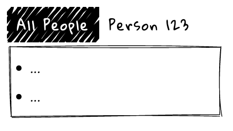

= Advanced Minimalist Fulcro Tutorial
:toc:
:toc-placement!:
:toclevels: 2
:description: A follow-up to the Minimalist Fulcro Tutorial that focuses on a few non-essential yet often necessary topics in the traditional minimalist way.

:url-book: https://book.fulcrologic.com/
:url-eql: https://edn-query-language.org/eql/1.0.0
:url-pathom: https://blog.wsscode.com/pathom/v2/pathom/2.2.0/

Author: https://holyjak.cz/[Jakub Holý] & contributors

A follow-up to the Minimalist Fulcro Tutorial that focuses on a few non-essential yet often necessary topics in the traditional minimalist way.

WARNING: This is work in progress, at a very early stage. Come back in a few weeks or months.

toc::[]

== Troubleshooting Fulcro

It is essential for your productivity that you get good at troubleshooting Fulcro, i.e. detecting why something does not work as expected. A key part of that is understanding Fulcro enough to know where to "zoom in" and leveraging Fulcro Inspect - especially the DB view, Transactions, and Network - at maximum. I claim that:

> In Fulcro, UI is a true function of data and in 90% cases you only need to look at the data and their connections - and perhaps transactions - to understand what is wrong. In 90% of these cases that beginner encounter, the problem is a broken connection between data. (Not including `get-query` in the parent's query, not setting/propagating up initial state where it is necessary.)

Hopefully you have got somewhat proficient with Fulcro Inspect when doing the https://github.com/fulcro-community/fulcro-exercises[Fulcro exercises]. Remember to play with it and dig around to really understand your application while it is working and as you are changing it so your skills will be sharp when you need them. The https://www.youtube.com/playlist?list=PLYvJiiE4TAijBAvO-R0PO8plSto4wtoQu[Learning Fulcro - troubleshooting demos] - a series of short screencasts demonstrating how to troubleshoot various problems in a Fulcro app - can help you.

Finally, remember to consult the https://blog.jakubholy.net/2020/troubleshooting-fulcro/[Fulcro Troubleshooting Decision Tree], which guides you to get from a problem to the most appropriate troubleshooting steps. I would also highly recommend that you use https://github.com/holyjak/fulcro-troubleshooting[fulcro-troubleshooting] to get notified early and visibly about possible problems and to watch out for Fulcro warnings in the browser Console.

TIP: Remember that only rarely you should be clicking around your UI and observing its changes. In Fulcro, you can trigger essentially any action (`transact!`, ...) from the REPL, you can use functions to simulate turning a query into the props tree, etc. Use these tools instead - they are more more effective and allow you to zoom in on the problem much more precisely.

== What to do when UI Components and Data Entities do not match 1:1

In the simplest case, each UI Component such as Player and Team corresponds to a data entity (player and team, respectively). But often that is not the case. What if I want to wrap Player in a CoolAnimationThingy (no data entity)? What if I want to show only a PlayerSummary inside the Team and only display PlayerDetails in a popup after you click the summary? (Both display different views of the same data entity.)

The article https://blog.jakubholy.net/2020/fulcro-divergent-ui-data/[Fulcro Explained: When UI Components and Data Entities Diverge] so I only provide a brief summary here.

A UI-only ("stateless") component, such as the CoolAnimationThingy, with no query of its own:: 
Solution: The nearest stateful (with a query) ancestor component (Team in our example) becomes the true parent of any stateful children of the stateless component, composes their query and initial state, creates them and passes them to the stateless component as its children.
A Data-only component (a.k.a. a query component)::
This is mostly only necessary when describing to Fulcro the data returned by a mutation, if it does not match an existing component. Solution (since Fulcro 3.5): use `rc/nc`; ex.: `(com.fulcrologic.fulcro.raw.components/nc [:user/id :user/email])`.
Multiple UI views of a single Data Entity::
This the case of the PlayerSummary and PlayerDetails and it is simple: they both use the same `:ident` (here, `:player/id`) and query for whatever they need.
A Data Entity spread across multiple (sibling) components::
Imagine you have a large data entity with many attributes. Displaying it in a single component would make it huge and hard to understand so you want to split the UI in multiple components, each displaying only a part of the entity. It differs from the "multiple views" by that they are all children of the <Entity> component and you want to load all the data at once. The solution is actually in Pathom: for each of these "virtual" (from the data view) children, include their query in the actual entity component as usual but under a made-up key starting with `:>/` (the habitual Pathom "placeholder" ns).
Accessing top-level data from a nested component::
Sometimes you have a piece of data that you need at multiple place in the UI tree, loaded at the top of the client DB, for example `:current-user` (to display her name in the top bar and to only show the buttons allowed by her permissions everywhere). The simple solution is link:{url-book}#_link_queries[link query]: instead of including in your query `[... :current-user ...]` (which would only work in the root component), you would include `[... [:current-user '_] ...]`, which is an ident with the magical value `_` meaning "all of it". 
In more extreme cases, you might need to split your UI into multiple independent parts, using Fulcro's multiple-roots-renderer.
Inserting a stateful UI component between a parent-child entities::
This essentially explains why inserting a router component into your UI does not break the query.

== Routing

In a single page application, you want to enable the user to navigate to parts of the application and to only display these "active" parts. You might also want to load the necessary data - and perhaps also the code -  only when you are are about to display the relevant part of the UI. Often you also want to bind the route to the URL. All this is the task of routing.

Fulcro's link:{url-book}#_dynamic_router[Dynamic Routing] enables you to:

1. Make Routers that have multiple target components and only display the active one (i.e. the one you have routed to)
2. The routers can be nested, e.g. to display a particular "page" and then a particular "tab" within it
3. Bind the route to the URL (Fulcro's routing is fully independent of the URL but the two can be hooked together)
4. Load data when the component is about to be displayed
5. The target component can dynamically decide whether to allow the user to route to it or to route out of it (e.g. you do not want to allow the user to leave a half-filled form until she either saves it or cancels the edit)
6. Split the code so that parts of it can only be loaded when the relevant part of the application is going to be displayed
7. Only query for the props of its current target from the client DB, which is important for the performance of bigger apps
8. TODO: Timeouts, errors, ...

=== The bare essentials of Fulcro routing

To add routing to your application, you need to:

1. Create a router with `dr/defrouter` (which just produces a `defsc`) and with the list of the target components, of which it should display one
2. Give each target component a unique _route segment_ - think of it as a URL - so that you can route to this target. It starts with a non-empty literal string and may contain other strings and placeholders (keywords) for capturing dynamic _route parameters_ such as IDs. They do compose, if you have multiple levels of nested routers.
.. The component can use the `:will-enter` hook to access the route parameters (which are always strings) and to translate them into the actual ident via `(dr/route-immediate <ident>)` or `route-deferred`
3. Initialize everything and route to the target you want displayed via `dr/change-route`

Let's explore a minimalist example of routing. This is the UI that we are creating:

image::bare-essentials-routing-ui-mockup.png["A mock up of a UI with a router (via wiredjs.com)"]



+++<!--FIXME: Remove the relative path img above-->+++

We show either all the people or just a single person. This is the code:

.Bare essentials of Fulcro routing (1st half - router & targets)
====
```clojure
(defsc AllPeople [_ {:keys [all-people]}]
  {:ident (fn [] [:component/id ::AllPeople])
   :query [{:all-people [:person/id :person/name]}]
   :initial-state {}                                 ; <1>
   :route-segment ["all"]}                           ; <2>
   (dom/div
     (dom/h3 "All People")
     (dom/ul
       (mapv (fn [{:person/keys [id name]}] (dom/li {:key id} name))
         all-people))))

(defsc Person [_ {:person/keys [id name biography]}]
  {:ident :person/id
   :query [:person/id :person/name :person/biography]
   :initial-state {}                                   ; <1>
   :route-segment ["person" :person-id]                ; <3>
   :will-enter (fn [app route-params]                  ; <4>
                 (dr/route-immediate
                   [:person/id
                    (js/parseInt (:person-id route-params))]))}
  (dom/p (str "Person #" id ": ") (dom/strong name) " - " biography))

(dr/defrouter MyRouter [_ _] {:router-targets [AllPeople Person]}) ; <5>
```
====
<1> A router target _must always_ have a non-nil initial state (so at least an empty `{}`)
<2> A target's `:route-segment` assigns it a routing path (relative to an ancestor target, if any)
<3> The `:route-segment` may also contain placeholders to capture parameters from the route (here `:person-id`),
    which can then access in `:will-enter` under that keyword
<4> A target may use the `:will-enter` hook to access route params and to tell Fulcro which ident
    to route to (here via `dr/route-immediate`)
<5> `defrouter` creates the router component. It needs at least the list of its targets in `:router-targets`

.Bare essentials of Fulcro routing (2nd half - Root and init)
====
```clojure
(def ui-my-router (comp/factory MyRouter))

(defsc Root [this {:ui/keys [router]}]
  {:query [{:ui/router (comp/get-query MyRouter)}]           ; <1>
   :initial-state {:ui/router {}}}                           ; <2>
  (dom/div
    (dom/p (dom/button {:onClick #(dr/change-route! this ["all"])} "All") ; <3>
           (dom/button {:onClick #(dr/change-route! this ["person" "123"])} "Person 123"))
    (ui-my-router router)))

(defn init [app]
  ;; Avoid startup async timing issues by pre-initializing things before mount
  (app/set-root! app Root {:initialize-state? true})
  (dr/initialize! app)                                         ; <4>
  (run! #(merge/merge-component! app Person %
           :append (conj (comp/get-ident AllPeople {}) :all-people))
    [#:person{:id 100 :name "Kamča" :biography "..."}
     #:person{:id 123 :name "Doubravka" :biography "..."}])
  (dr/change-route! app ["person" "123"]) ; after set-root or mount! ; <5>
   ;; or: (dr/change-route! app (dr/path-to Person "123"))           ; <6>
   ;; or: (dr/change-route! app (dr/path-to Person {:person-id "123"})) ; <6>
  (app/mount! app Root "app" {:initialize-state? false}))
```
====
<1> The router's query is composed into its parent, under an arbitrary name (the `:ui/` ns is practical so that we do not unnecessarily include it in queries sent to the server)
<2> You _must_ compose the router's initial state into its parent (notice we use the https://book.fulcrologic.com/#_template_mode[template mode of initial state] so the `{}` actually means "include the router's initial state")
<3> We use `dr/change-route!` with the absolute route (concatenation of all route segments along the way from Root) to display the desired component
<4> When we start the application, we need to initialize the dynamic routing subsystem with `dr/initialize!`
<5> It is highly advisable to also make sure each router in the app is "routed" and thus in a well-defined state before it is ever displayed. Here we achieve that by routing to it in the init function. This can only be done after the application's state is initialized, i.e. either `app/set-root!` with `{:initialize-state? true}` or `app/mount!`
<6> Alternatively, instead of hard-coding the route as a vector of strings, we can use `(path-to & targets-and-params)` with component names to get the route - which is easier to navigate and to refactor. In the map form, there is just a single map with all the route's params at the very end.

See the https://github.com/holyjak/minimalist-fulcro-template-backendless/blob/example/bare-essentials-routing/src/com/example/ui.cljs[full code here].

=== Binding the route to the URL

Reflecting the current route in the URL and changing the URL according to the route is simple.

NOTE: To make sure the user can reload the URL from the server, make sure that any path other than images, JS etc. fall backs to the application HTML page - https://github.com/fulcrologic/fulcro-rad-demo/blob/develop/src/shared/com/example/components/ring_middleware.clj#L48[see how fulcro-rad-demo does it].

=== Loading data on displaying a component (for the first time)

+ handling err, "loading..."

=== Nesting routers

Having a UI tree with multiple levels of nested routers like this:

....
Root
  PageRoute
    WelcomePage
    SportPage, route `["sport" :sport]`
      Teams
        TeamRouter
          TeamStats, route ["team-stats"]
          Player, route ["player" :player-id]
....

we can route to a leaf router including the full route:

```clojure
(dr/change-route! app-or-component ["sport" "hockey" "player" "123"])
;; We could also leverage path-to:
(dr/path-to app-or-component SportPage "hockey" Player "123")
; =>  ["sport" "hockey" "player" "123"]
(dr/path-to app-or-component SportPage Player {:sport "hockey", :player-id "123"})
; =>  ["sport" "hockey" "player" "123"]
```

Somewhere under a router target, we can also use relative routing:

```clojure
;; e.g. inside Teams:
(dr/change-route-relative! teams-this ["player" "123"])
```

We can even route from one target to another sibling target:

```clojure
;; e.g. inside Player:
(dr/change-route-relative! player-this [:... "team-stats"])
```

IMPORTANT: 
It is essential that each router in the app is in a routed state before it is displayed. 
Always route to a leaf target! (Or do so at least once, e.g. during app initialization.)
(A router will display its first target by default but it is not the same as routing to it manually and some things will not work.) See link:{url-book}#_partial_routes[20.6.1. Partial Routes] for details.

=== A router inside a newly ``load!``ed component

If the parent component of a router did not exist upon application initialization - for example because it has a dynamic ident such as `:ident :person/id` and its data was ``load!``-ed later - then it will not be "linked" properly to the router, i.e. its data in the client DB will miss something like `:<the router prop you made up> [::dr/id :<YourRouterComponentName>]`. (Remember that `:initial-data` only has an effect at the application start and not when you later add new data.) Thus you need to add the "link" manually, using link:{url-book}#_pre_merge[`:pre-merge`]. Pre-merge gets the loaded, denormalized data and returns denormalized data.

```clojure
;; Somewhere in the app: `(df/load! app [:person/id 123] MyPerson)`
(defsc MyPerson [_ props]
  {:ident :person/id
   :query [:person/id :ui/person-router ...]
   :initial-state {:ui/person-router {}}                         ; <1>
   :pre-merge (fn [{:keys [loaded-data-tree current-state-map]}] ; <2>
                (merge (comp/get-initial-state MyPerson)         ; <3>
                  {:ui/person-router (get-in current-state-map (comp/get-ident PersonRouter {}))} ; <4>
                  loaded-data-tree))}
  (ui-person-router (:ui/person-router props)))
```
<1>: The parent of a router must compose its initial state into its own (and so on all the way to the Root)
<2>: Pre-merge gets the (denormalized) tree of data from `df/load!` and the current value of the client DB (a.k.a. state map)
<3>: We include the component's initial state, which composes the initial state of the router
<4>: We make sure to preserve any state the router might already have (which we must denormalize)
// FIXME: Do I need both <3> and <4> ?! Isn't 4 enough?

Read more in the Fulcro Book, link:{url-book}#_composing_the_routers_state_into_the_parent[20.4. Composing the Router’s State into the Parent].

=== A brief overview of useful dr/* functions

=== TODO

.TODO
----
Ideas:

* How does it work?
** Set `::dr/current-route` to the selected target's query, pass
   `(::dr/current-route props)` to the target comp. as its props
   (+ pass through any computed props)
** https://blog.jakubholy.net/2020/fulcro-divergent-ui-data/#_inserting_a_stateful_ui_component_between_a_parent_child_entities[When UI and Entities Diverge: Inserting a stateful UI component between a parent-child entities]
* Use cases: top router a la RAD x ... ?

> An even better approach is to use state to block rendering until such time as a route or load is ready just by looking at the current state of your top-most router’s state machine. 
> -- the Book, https://book.fulcrologic.com/#_setting_the_route_early

IMPORTANT: Singletons. 1+ targets (1 <> dynamic segment).
----

== Creating and editing data entities

=== Tempids and creating new entities

=== Form state management

== Etc... (UISM, dynamic.recursive/union queries, ...)